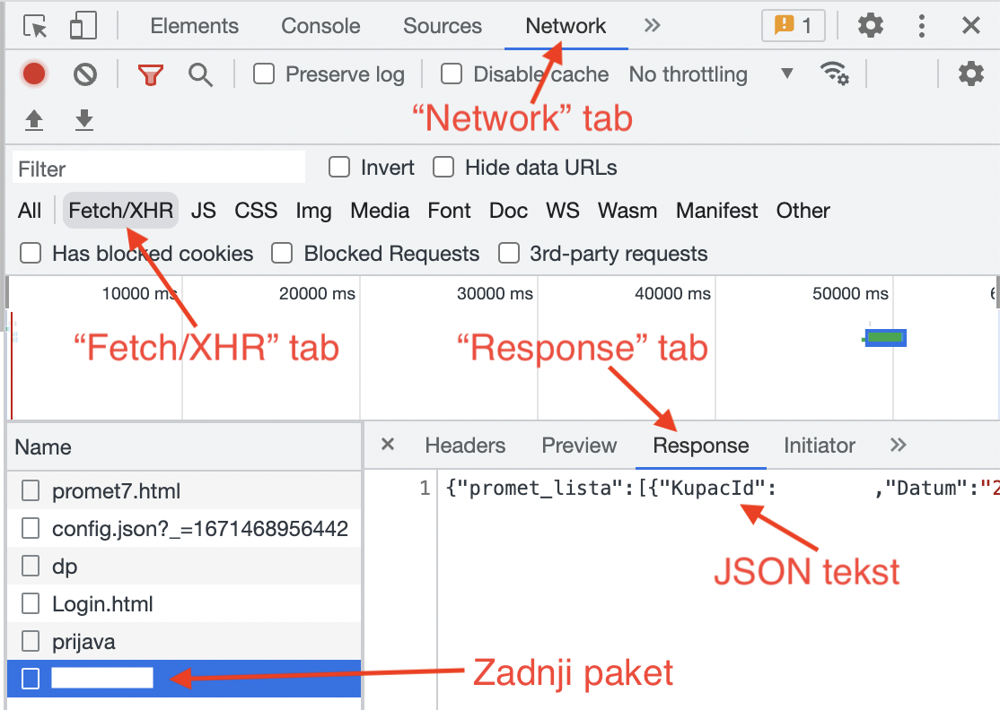

# obrada podataka sa stranica mojracun

## mojracun.hep.hr

Trenutno je napravljena skripta `hep.py` koja učitava `json` file koji se dobije sa hepove stranice *mojracun*.
Skripta računa koliko je novaca potrošeno na struju u jednom mjesecu.
Obračuni se ubrajaju na sve mjesece podjednako od prošlog obračuna.

U skripti je potrebno podesiti varijablu `CURRENT_DEBT` koja označava trenutno zaduženje koje je napisano na stranici i varijablu `FIRST_MONTH` koja označava najraniji mjesec koji se pojavljuje u podacima (`day` argument `date` objektu mora biti `1`).

Json file se može skupiti sljedećim koracima:

1. odlazak na stranicu za login: https://mojracun.hep.hr/elektra/index.html#!/login
1. desni klik -> "Inspect"
1. klik na "Network" tab
1. refresh stranice (ctrl-r)
1. klik na tag Fetch/XHR
1. upis vlastitih podataka u Korisničko ime i lozinku
1. klik na zadnji paket u "Network" tab-u
1. klik na "Response" tab

# budući rad

## mojracun.gpz-opskrba.hr

Gradska plinara ne daje informacije o uplatama unazad više od par mjeseci, ali zato daje relativni popis stanja od kojeg se da naslutiti koliko je otprilike bio račun.
Trenutno sam samo napravio skriptu koja učitava podatke sa stranice ispod tablice **STANJE PLINOMJERA NA ODABRANOM OBRAČUNSKOM MJERNOM MJESTU**.
